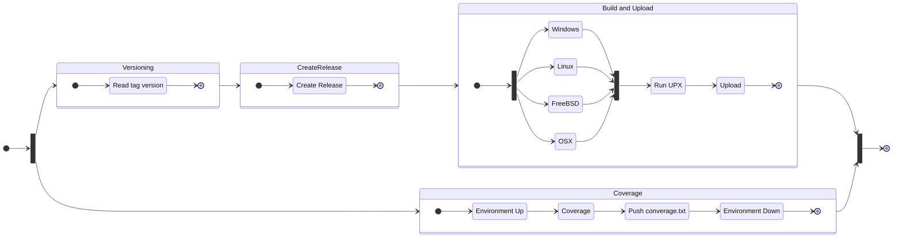

# Continuous integration

## Complete CI

## Pipes

### Test

| Feature     | Value                             |
| ----------- | --------------------------------- |
| Executes    | On **PR** to `dev`                |
| Permissions | **Read only** repository contents |

### Tagging

| Feature     | Value                              |
| ----------- | ---------------------------------- |
| Executes    | On **Pushes** to `dev`             |
| Permissions | **Read/Write** repository contents |

### Release

| Feature     | Value                                                        |
| ----------- | ------------------------------------------------------------ |
| Executes    | On **Pushes** to `main`                                      |
| Permissions | **Read only** repository contents, **Read/Write** releases, **Read/Write** packages |

