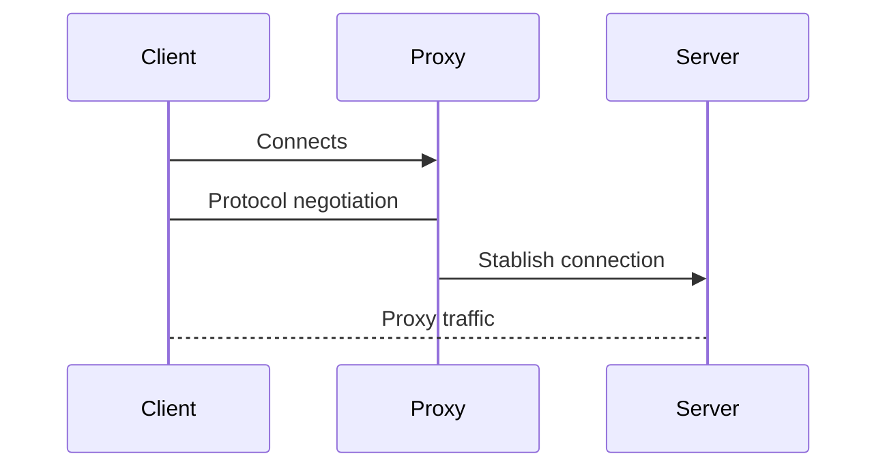
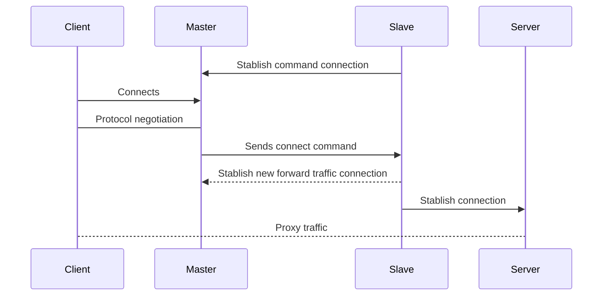

# Pipes

Pipes are used to separate the logic of proxying protocols and network connections.

## Bind pipe

### Successful negotiation

## Master / Slave pipe

This pipe is intended to forward traffic accessible by a machine that cannot bind but can connect to external servers,
for this same reason this kind of proxy pipe doesn't support commands like **SOCKS5 BIND**.

